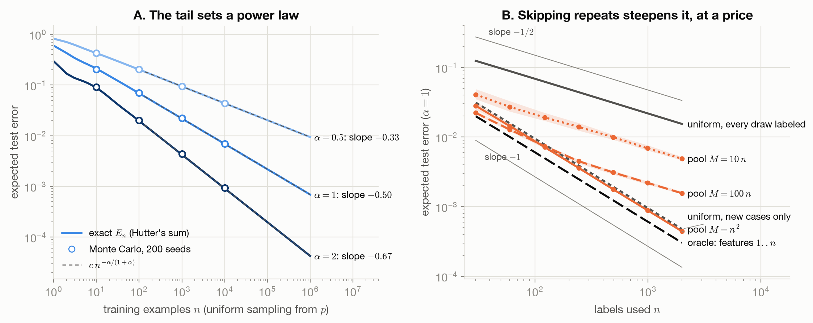

# data-lab



- Site: **[ioannisantoniadis.github.io/data-lab](https://ioannisantoniadis.github.io/data-lab/)**

*What the Model Sees: Training Data from First Principles*: a short book, with code, on data
for learning. It covers:

- where data comes from;
- how it is cleaned, scaled, transformed and encoded, and when each choice matters;
- how the training distribution is shaped by sampling, weighting and augmentation;
- how much data a problem needs, and which data.

The last part runs from learning curves to scaling laws, and to why the long tail makes returns
diminish. The book is a sibling of
[loss-functions-lab](https://github.com/ioannisantoniadis/loss-functions-lab) (what to optimize)
and [optimization-lab](https://github.com/ioannisantoniadis/optimization-lab) (how to optimize).
This book covers what the model is optimized *on*.

**Status:** Phases 0–3 done; Phase 4 (synthesis) drafted, 2026-10-05: every chapter and
appendix is written and the final audit passed; reader tests are optional. Public; the site is
deployed from `main` by GitHub Actions. **License:** MIT. **Authors:** Ioannis Antoniadis, with Claude (Anthropic).

## What this book adds

A Phase 0 search of the closest books and courses (logged in [`research-log.md`](research-log.md))
found none that does both of the following:

1. places every data technique on one lens (which of the representation, the sampling
   distribution, the per-example weights or the labels it changes) and tests it against
   exact ground truth;
2. puts classical preprocessing and modern data selection and scaling laws in one argument.

Feature-engineering books cover the first half of the material without a lens or ground truth.
Data-centric AI courses cover curation and, for LLMs, scaling, but not transforms. The long-tail
account of diminishing returns is already computable in the research literature (Hutter 2021;
Dohmatob et al. 2024). The book reproduces it exactly, in a form a practitioner can run, and
connects it to the levers.

## Layout

| Path | What it is |
|---|---|
| [`SPEC.md`](SPEC.md) | The implementation contract |
| [`DECISIONS.md`](DECISIONS.md) | Owner decisions, open and closed |
| [`CONVENTIONS.md`](CONVENTIONS.md) | How chapters, data cards, figures and tests are written |
| [`ROADMAP.md`](ROADMAP.md) | Phase status, findings, decision log |
| [`COVERAGE.md`](COVERAGE.md) | Every coverage item, with its depth and chapter |
| [`research-log.md`](research-log.md) | Every source consulted, and to what depth |
| [`review.md`](review.md) | The `skeptical-review` of the thesis (Phase 0) |
| [`audits/`](audits/) | Fresh-agent audits and the chapter 13 review, each with its resolution |
| `docs/` | The Quarto book: the Map, 15 chapters, 5 appendices |
| `src/data_lab/` | The local package: testbeds T1–T5 and one module per topic (sampling, labels, cleaning, transforms, augment, shift, curves, scaling, selection, worked examples) |
| `tests/` | One test per checkable claim (SPEC §8, claims 1–46), plus tooling tests |
| `docs/_variables.yml` | Every number quoted in the prose, written by the figure scripts |
| `scripts/technique_data.py` | Records that generate every data card, the decision guide and the toy-limits appendix |
| `scripts/figures/` | One script per figure, and the shared theme with `save_figure` |
| `scripts/word_count.py` | Prose word count; CI fails above the 35,000-word cap |
| `scripts/check_portability.py` | Portability rules for a future PDF |

## Commands

```bash
uv sync                                   # Python >= 3.11, locked dependencies
uv run ruff check .
uv run pytest
uv run python scripts/word_count.py
uv run python scripts/check_portability.py
uv run python scripts/technique_data.py   # regenerate cards, the guide and the toy limits
quarto render docs                        # Quarto CLI installed separately
```

The `data_lab` package is local only: `uv sync` installs it into the repository's environment,
and it is never published to PyPI (DECISIONS D2).
